<!--
  Praful Singh — GitHub Profile README (v2, SVG dashboard)
  Repo: RajputPraful/RajputPraful (public)
  Custom animated cards live in ./assets (generated by scripts/generate_assets.py).
  Generated at runtime: github-metrics.svg + github-metrics-calendar.svg (metrics.yml), snake SVGs on `output` branch (snake.yml).
-->


 

 



 


  

 

<code>public activity only · updated live by GitHub widgets</code>

 

  

  

<picture>
  <source media="(prefers-color-scheme: dark)" srcset="https://raw.githubusercontent.com/RajputPraful/RajputPraful/output/github-snake-dark.svg"/>
  <source media="(prefers-color-scheme: light)" srcset="https://raw.githubusercontent.com/RajputPraful/RajputPraful/output/github-snake.svg"/>
  
</picture>

  

<code>metrics generated daily by lowlighter/metrics</code>

 

 
<code>currently being designed and developed · planned scope, not a claim of production readiness</code>

 

 
<code>none of these are claimed as deployed production systems</code>

 

<code>LANGUAGES</code> 

  

<code>FRONTEND</code> 

  

<code>BACKEND</code> 

  

<code>DATABASE</code> 

  

<code>TOOLS</code> 

  

<code>CONCEPTS</code> 
<code>Data Structures &amp; Algorithms</code> <code>DBMS</code> <code>OOP</code> <code>REST APIs</code> <code>Backend Architecture</code> <code>System Design</code> <code>Software Architecture</code> <code>Problem Solving</code>

 


 

 
I prefer understanding systems instead of blindly implementing code. 
I use AI to accelerate development, but architecture, verification, testing, security and product decisions still require human reasoning.

 

 
<code>AI helps with: rapid prototyping · debugging · research · architecture exploration · documentation · repetitive implementation · learning unfamiliar tech · testing ideas</code>

 



 

 


 

 

